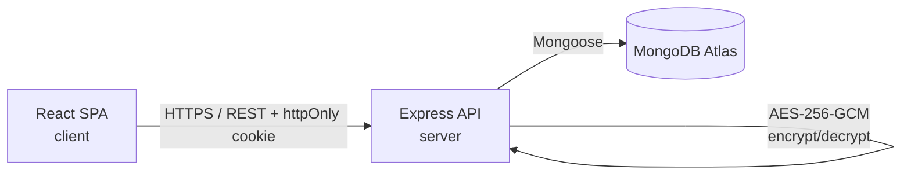
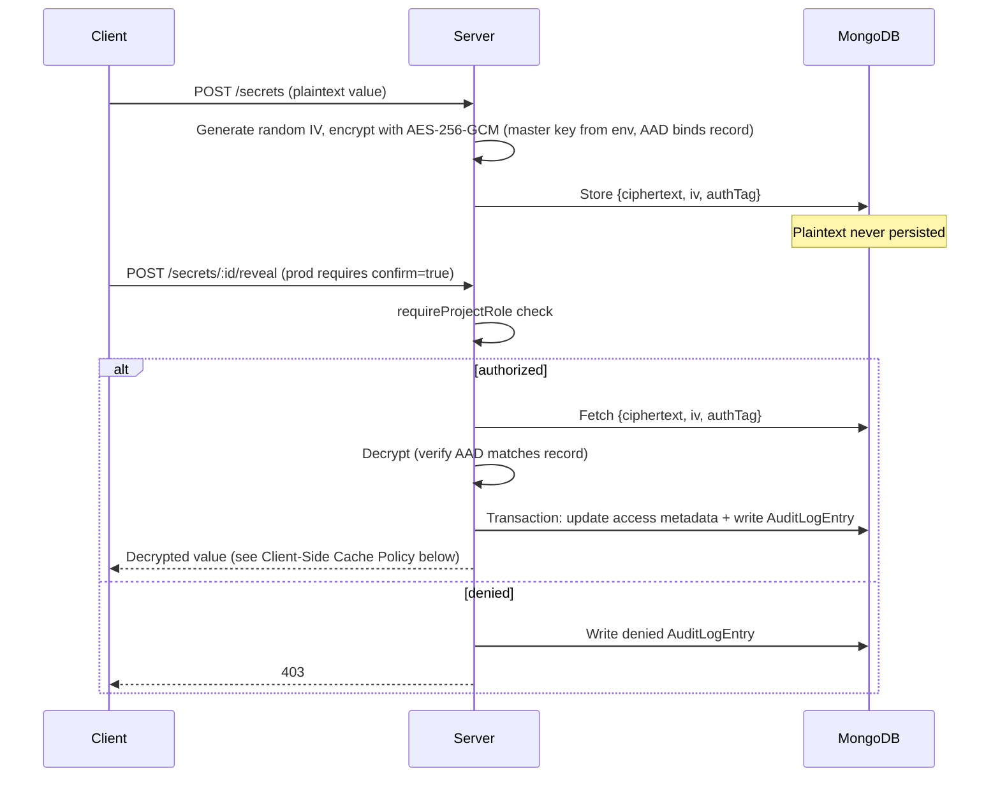

# Architecture

## System Overview



The hierarchy is Project → Secret, where each `Secret` carries an
`environment` field (`development` / `staging` / `production`) rather than
Environment being its own collection — see DATA_MODEL.md for the full
schema. The client never talks to the database directly and never performs
encryption or decryption — both are exclusively server responsibilities.
The client only ever receives a decrypted secret value in the direct
response to an explicit, authorized reveal request; it is never included
in list/metadata responses.

## Repository Boundaries

- **`client/`** — presentation layer only. Holds UI state (active tab,
  open modals) and uses TanStack Query hooks to fetch/cache server state.
  Contains no business logic about who is allowed to see what — it reflects
  what the server allows, and treats a 403 as an expected, handled response.
- **`server/`** — owns all authorization decisions, encryption, and audit
  logging. No route trusts the client to say what role a user has; role and
  project membership are looked up server-side on every request.
- **`packages/shared-schemas/`** — Zod schemas are the single source of
  truth for both validation and typing, but "one schema per entity" means
  one definition *lineage* per entity, not one object reused unchanged
  everywhere. The lineage runs from client-safe to server-only, never the
  other way round, so sensitive field names don't end up in the client bundle:
  - **Client-safe schemas (package root):** `secretResponseSchema`
    (metadata only — no `value`, no `ciphertext`/`iv`/`authTag`),
    `secretCreateInputSchema` (`{ environment, key, value }`) and
    `publicUserSchema`. They share small field validators (e.g. the `key`
    pattern) so rules aren't duplicated. A reveal response is
    `secretResponseSchema` plus a decrypted `value`, as its own small schema.
  - **Server-only base schemas (`shared-schemas/internal`):**
    `secretSchema = secretResponseSchema.extend({ ciphertext, iv, authTag })`
    and `userSchema = publicUserSchema.extend({ passwordHash })`. Only
    `server/` imports these; `client/` is blocked by an ESLint
    `no-restricted-imports` rule (PROJECT_STRUCTURE.md). Deriving the
    client-safe shapes from the base with `.omit()` would not work: the
    derivation runs at import time, so the base — with the `passwordHash` and
    `ciphertext` field names — would be bundled into the client.

  TypeScript types are inferred from whichever schema is relevant with
  `z.infer<typeof schema>`, so there's still no separate, hand-written
  interface to drift out of sync with the validation rules — the shared lineage is what keeps a create-input type, a response type, and an internal type honest against each other, instead of three independently-maintained ones.

  **Typing a response as the narrow schema isn't what keeps `passwordHash`
  or `ciphertext` out of it — parsing it is.** A TypeScript type is a
  compile-time annotation; it doesn't touch the object at runtime, so if a
  handler accidentally sends the full Mongoose document (which still has
  `passwordHash` on it) while merely *claiming* the response is typed as
  `publicUserSchema`, nothing stops the extra field from being serialized
  over the wire — the type checker has no runtime presence to object.
  The actual guarantee comes from calling `publicUserSchema.parse(user)` /
  `secretResponseSchema.parse(secret)` before sending the response: Zod's
  default `.parse()` behavior strips any key not declared on the schema
  (no `.passthrough()`), so even a handler that forgot `select: false`
  somewhere, or passed the raw document instead of a plain object, gets
  the sensitive fields dropped at serialization time regardless. This is
  genuine defense-in-depth, not redundant with `select: false` — the two
  catch the same mistake at two different layers.

See PROJECT_STRUCTURE.md for the full folder layout and module boundaries.

## Access Model

Access is controlled by **one global flag plus three per-project roles** —
this is deliberately not framed as "four roles," since `isPlatformAdmin`
and project membership are different mechanisms, not four peers of the
same kind:

- `User.isPlatformAdmin: boolean` — a global flag, unrelated to any
  specific project.
- `ProjectMembership.role: 'projectAdmin' | 'developer' | 'auditor'` — one
  document per (user, project) pair; a user's role can differ across
  projects.

## Authentication Flow

1. User submits email/password. The server looks up the user by email
   with `.select('+passwordHash')` — `passwordHash` is `select: false` by
   default (DATA_MODEL.md), so login is the one query in the codebase
   that deliberately opts back in, since it's the one place that
   genuinely needs the hash to compare against. **To avoid a timing side channel, login always runs bcrypt whether or not a matching account exists** — it runs `bcrypt.compare()` against *something* — the real `passwordHash` if found, a fixed dummy hash (a precomputed valid bcrypt hash of a constant placeholder string, checked into the codebase) if not. This isn't optional: a generic error **message** alone doesn't close a timing side channel — skipping the deliberately-slow bcrypt call entirely for unknown emails makes "no such account" measurably faster than "wrong password," which an attacker can use to enumerate valid emails even though the message itself never says so. A deactivated (`isActive: false`) account that supplies the *correct* password gets the same outcome as a wrong password — generic `401`, no distinct message — a deliberate choice, not an oversight: a distinct "this account is deactivated" message would confirm the email is both registered and currently deactivated, which is exactly the information you don't want to hand back to someone deactivated for a security incident (PRODUCT.md story 7).
2. On success, the server issues a JWT and sets it as an **httpOnly
   cookie** — `SameSite=Lax` by default, `None` in production unless
   `COOKIE_SAMESITE` overrides it (see Cross-Origin Deployment & CSRF,
   below; there's no single fixed `SameSite` value across this build, so
   it's not restated here). Not stored in localStorage, to reduce
   XSS token-theft risk.
3. Every subsequent request includes the cookie automatically
   (`credentials: 'include'` on the client).
4. An `authenticate` middleware verifies the JWT and attaches `req.user`
   before any route handler runs.

**`tokenVersion`, and why it exists:** `User.tokenVersion` (number,
default `0`) is embedded in the JWT at login and compared against the
user document's *current* `tokenVersion` on every request; a mismatch is
treated as an invalid token (`401`), the same as a bad signature. This
closes a real hole in the bootstrap promotion flow (PRODUCT.md story 11):
resetting a squatter's `passwordHash` on promotion stops them logging in
*again*, but does nothing about a JWT they already hold — cookies live up
to 7 days, and `authenticate` re-checking `isPlatformAdmin` on every
request doesn't invalidate a token just because the password behind it
changed. Bumping `tokenVersion` alongside the password reset makes that
existing cookie fail its next request immediately, regardless of how much
of its 7-day lifetime remains. The only place this build currently bumps
it is bootstrap promotion (there's no self-service password-change
endpoint in scope to trigger it otherwise), but the mechanism is general —
adding "log out everywhere" later is then just one more place that
increments the same field, not a new mechanism. **Bootstrap also creates and initializes the `PlatformConfig` singleton with `activePlatformAdminCount = 1`.**

## Authorization (RBAC) Pipeline

Every protected route passes through middleware in this order:

```
CSRF check  →  authenticate  →  requireProjectRole / requireProjectRoleOrPlatformAdmin / requirePlatformAdmin  →  requireProjectStatus  →  route handler
```

- **CSRF check** — state-changing requests (POST/PATCH/DELETE) verify the `Origin` header matches `CLIENT_ORIGIN`. Fails with 403 before `authenticate` runs. Not logged as `AuditLogEntry`.
- **`authenticate`** — verifies JWT (signature **and** `tokenVersion` match), attaches `req.user` (id, `isPlatformAdmin`).
- **`requireProjectRole(['projectAdmin', 'developer'])`** — used on routes only a project member can ever reach (secrets, project audit log, `GET /projects/:projectId`). Looks up the caller's `ProjectMembership` for the `:projectId` in the route and attaches `req.projectRole`. Two different failures get two different responses: no `ProjectMembership` at all returns **404** (existence isn't revealed to non-members, matching API.md's error table), and this case does **not** write an `AuditLogEntry` — there's no project team for such an entry to be visible to, and no `action` enum value represents a bare access probe. A membership that *does* exist but whose role isn't in the allowed list returns **403**, logged as a denied `AuditLogEntry` when the underlying action has a corresponding `action` value (create/edit/delete/reveal, membership changes) — a plain read that fails this check has nothing to log against either, same as the 404 case.
- **`requireProjectRoleOrPlatformAdmin(['projectAdmin'])`** — a distinct
  middleware, not a parameter on `requireProjectRole`, used on the three
  Project Membership routes (`POST`/`PATCH`/`DELETE
  /projects/:projectId/members`) whose own Access column says "`projectAdmin`
  or `isPlatformAdmin`". Plain `requireProjectRole` can't express that: a
  Platform Admin with no `ProjectMembership` on the target project would
  hit its 404 branch and never reach the handler. This middleware checks
  `req.user.isPlatformAdmin` **first** and short-circuits straight through
  if true, skipping the membership lookup entirely; otherwise it falls
  through to the same logic `requireProjectRole` uses. A Platform Admin
  using this bypass is still subject to the project-status check below —
  acting on members still requires an active project, same as any member
  route. (`/admin/*` routes aren't project-scoped and don't use project middleware at all.)
- **Project status check (`requireProjectStatus`)** — every `:projectId`-scoped member route
  (project detail, members, secrets, project audit log) requires
  `Project.status === 'active'`, including when reached via
  `requireProjectRoleOrPlatformAdmin`'s bypass. **Order matters here, and
  it's membership first, status second, never the other way round:** the
  membership check (404 for non-members, above) always runs before the
  status check. If status ran first, a non-member probing an *archived*
  project's URL would get 403 ("exists, but you can't touch it") instead
  of 404 ("no membership that would reveal even its existence") — leaking
  exactly the existence information the 404 branch exists to hide, just
  for archived projects specifically. Running membership first means only
  a caller who already has a `ProjectMembership` (or the Platform Admin
  bypass) can ever reach the status check at all, so **403 for "archived"
  is only ever seen by someone who already knew the project existed** —
  consistent with the reasoning for using 403 here instead of 404 in the
  first place. Logged the same way as any other 403: only when the action
  has a corresponding `action` enum value, so writes are logged and plain
  reads aren't. `GET /api/projects` (the list, with no `:projectId` in its
  own path) is **not** gated by this check — it still returns archived
  projects the caller belongs to, with `status: 'archived'` in the
  response, so members can see what happened to a project instead of it
  silently vanishing from their list; they just can't drill into it
  further. `/admin/*` routes aren't project-scoped and never pass through this check; the post-MVP archive/restore route will be one of them. **In the MVP nothing sets `status` to `archived`**, so this check is implemented and tested against a directly seeded archived project, but is unreachable through the API until archive ships.
- **`requirePlatformAdmin`** — used on `/admin/*` routes. Checks
  `req.user.isPlatformAdmin` directly, no project membership lookup
  needed, since it's a global flag.

One deliberate exception to "middleware is the only place authorization decisions are made" (PROJECT_STRUCTURE.md): the `development`-only write restriction for `developer` (create/edit) can't be a middleware check, because it depends on data middleware doesn't have yet — the target environment is either in the request body (`POST /secrets`, not parsed until the controller reads it) or on the existing document (`PATCH /secrets/:secretId`, not loaded until the service fetches it). **This is a role restriction** (can `developer` write here at all), distinct from reveal's `confirm`-required-on-production rule covered in the Secrets endpoint notes (API.md) — that one is a request-shape/business-rule check on an action every `developer` is already allowed to attempt, not a role gate, and it's handled separately (422, not logged as a denial — see the reveal endpoint). Don't read the two as the same mechanism just because both key off environment. The service layer makes the write-restriction call after `requireProjectRole` has already confirmed `developer`-or-above on the project, and writes the denied `AuditLogEntry` itself when it rejects — same transaction/logging pattern as every other denial, just one layer lower than usual. This is the one rule in the whole RBAC model that isn't resolved by the time a route handler runs, and PROJECT_STRUCTURE.md's module-boundaries section should be read with that carve-out in mind.

Layering note: middleware never touches Mongoose directly. It calls `membership.service` (membership lookups), `audit.service` (denied `AuditLogEntry` writes) and `secrets.service` (the scoped lookup described below), so "services are the only layer that talks to models" still holds.

This middleware chain is what makes the RBAC "real" rather than
UI-decoration: even a direct API call with a forged frontend request is
rejected at this layer before it reaches any controller logic. See API.md
for the full endpoint-by-endpoint access table.

## Secret Encryption & Reveal Flow



Auditor requests to the reveal endpoint are denied at `requireProjectRole`
before any decryption code runs — the request is rejected and logged the
same way any other denied attempt is. Separately, an Auditor's *list and
metadata* endpoints never select the `ciphertext`/`iv`/`authTag` fields in
the first place, so there's no decrypted value in memory to leak even from
a server-side bug on their read paths.

**Denied entries from `requireProjectRole` still need `environment` and
`secretKey` populated, which means one extra scoped lookup.** The
middleware rejects before any service code runs, so — unlike a
service-layer denial, which already has the document loaded — it has
no `environment`/`secretKey` to write onto the `AuditLogEntry` unless it
goes and gets them. Without this, an Auditor's denied reveal attempt
against a *production* secret would log with `environment` unset, and
the project audit log's `?environment=production` filter — the exact
query someone would run to check "did anyone try to touch prod they
shouldn't have" — would silently miss it. So for any denial on a
secret-scoped route, `requireProjectRole` performs one read,
`Secret.findOne({ _id: secretId, projectId }, { environment: 1, key: 1 })`
— scoped by `projectId` exactly like every other secret lookup (see
API.md's Conventions) — purely to enrich the denial record. This read
plays no part in the authorization decision itself, which was already
made on role alone; it only makes the resulting denied entry complete.

**Additional Authenticated Data (AAD):** every encrypt/decrypt call passes
`` `${projectId}|${secretId}|${environment}|${encryptionKeyVersion}` ``
as AAD via `cipher.setAAD()` / `decipher.setAAD()`, and `authTagLength: 16`
is set explicitly on the decipher rather than left to the library default.
On **create**, `secretId` can't come from Mongo's own auto-assigned `_id`
the usual way — encryption has to happen *before* the document exists to
be inserted, so the normal "insert, then Mongo hands back `_id`" order
doesn't work here. The service generates the id itself first
(`new mongoose.Types.ObjectId()`), uses that value in the AAD and the
encrypt call, then inserts the document with that same value explicitly
set as `_id` (Mongoose/Mongo both accept a caller-supplied `_id` on
insert, not only an auto-generated one) — so the id used in the AAD and
the id the document actually ends up with are always identical by
construction, not by coincidence.
Without AAD, GCM only guarantees the ciphertext wasn't tampered with — it
says nothing about which record it belongs to. Anyone with raw DB write
access could copy one `Secret`'s `{ciphertext, iv, authTag}` onto a
different document (say, a `development` secret's blob onto a `production`
secret) and it would decrypt cleanly, silently serving the wrong value to
whoever reveals it. Binding the record's own identity into the AAD makes
that swap fail decryption instead — the auth tag check fails because the
AAD no longer matches, exactly the way GCM is supposed to catch tampering.
This is a few lines on top of encrypt/decrypt calls the service is already
writing, not a new subsystem.

MongoDB transactions require a replica set — a bare standalone `mongod`
doesn't support `session.startTransaction()`. This isn't a constraint the
project has to work around: Atlas provisions every cluster, including the
free M0 tier, as a replica set by default, and since this project uses
Atlas from local development onward (see TECH_STACK.md's Database
rationale), transactions behave identically in dev and any later
deployment with no extra configuration. It's also why local dev points at
Atlas rather than a local standalone Mongo — the latter would silently
drop the reliability guarantee the audit log depends on.

## Session & Auth Policy

- **JWT lifetime:** 7 days, matching the cookie's `maxAge`. There is no
  refresh-token flow in this build — when the JWT expires, the user is
  simply required to log in again. A shorter lifetime would reduce the
  `isActive` revocation window (below) at the cost of more frequent
  logins; 7 days is chosen as a reasonable default for this scope and is
  configurable via `JWT_EXPIRES_IN`.
- **`isActive` enforcement:** checked on every request, not just at
  login. The `authenticate` middleware re-fetches the user document (it
  already needs to, to get a fresh `isPlatformAdmin` value) and rejects
  with 401 if `isActive: false`. This means deactivating a user takes
  effect immediately, on their very next request, regardless of how much
  of the JWT's 7-day lifetime remains — the JWT's own expiry is not the
  revocation mechanism.
- **Boot-time validation:** on server startup, the process exits
  immediately with a clear error — rather than starting and failing later
  on first use — if any of the following fail. This build recognizes
  exactly one active key/version pair (see DATA_MODEL.md's Encryption Key
  Lifecycle), so the key checks just confirm both exist and parse, there's
  no table of multiple keys to resolve against:
  - `MASTER_KEY` is present and base64-decodes to exactly 32 bytes.
  - `MASTER_KEY_VERSION` is present **and parses to a positive integer**
    (not merely non-empty — see DATA_MODEL.md's `encryptionKeyVersion`
    row for why a typo'd, non-numeric value needs to fail here rather
    than produce `NaN` comparisons later).
  - `JWT_SECRET` is present and at least 32 characters — short enough
    that a weak secret is easy to overlook, but HMAC-SHA256 signing
    security depends on the secret's entropy, so a minimum is worth
    enforcing rather than trusting whatever gets typed into `.env`.
    Separately, wherever the server calls `jwt.verify()`, it passes
    `algorithms: ['HS256']` explicitly rather than accepting whatever
    algorithm the token's own header claims — algorithm-confusion attacks
    (e.g. an attacker-crafted token claiming `alg: none`, or a public key
    misused as an HMAC secret) are a well-known JWT vulnerability class
    that an unpinned `verify()` call is exposed to.
  - `COOKIE_SAMESITE`, if set, is one of `Strict`/`Lax`/`None` — an
    invalid value fails loudly at boot instead of behaving unpredictably
    the first time a cookie is actually set.
  - `CLIENT_ORIGIN` is present **when `NODE_ENV=production`** — it's
    optional locally (defaults to `http://localhost:5173`), but silently
    falling back to that default in a real deployment would mean CORS
    and the Origin-based CSRF check both compare against a `localhost`
    URL no real client will ever send, effectively locking out the actual
    frontend rather than protecting against anything.
  - Independent of all of the above: the cookie's `Secure` attribute is
    `NODE_ENV === 'production'`-driven on its own, not tied to whichever
    `SameSite` value ends up in effect. If `COOKIE_SAMESITE=Lax` is used
    in production (the same-site custom-domain case from Cross-Origin
    Deployment & CSRF, below), `Secure` must still be `true` — HTTPS-only
    transmission is about the deployment being on HTTPS at all, not about
    which `SameSite` policy happens to be active.

## Cross-Origin Deployment & CSRF

Local dev is same-site (`localhost:5173` → `localhost:5000`), but the default Vercel → Render deployment is cross-site unless one of the same-site options under *Deployment topology* below is used, which changes cookie behavior:

- **Cookie attributes:** `SameSite=Lax` in development, `SameSite=None;
  Secure` in production (`NODE_ENV`-driven), since a cross-site request
  won't carry a `SameSite=Lax` cookie at all.
- **CORS:** the server sets `Access-Control-Allow-Credentials: true` and
  restricts `Access-Control-Allow-Origin` to a single explicit
  `CLIENT_ORIGIN` environment variable — never a wildcard, which is
  incompatible with credentialed requests anyway.
- **CSRF:** since `SameSite=None` no longer blocks cross-site cookie
  submission, state-changing requests (POST/PATCH/DELETE) additionally
  check that the `Origin` header matches `CLIENT_ORIGIN`, rejecting with
  403 otherwise. A **missing** `Origin` header is treated as a mismatch,
  not an exemption — it fails the same equality check and gets the same
  403, it isn't special-cased to pass. This is a lighter-weight
  mitigation than a double-submit token, and is considered sufficient
  here because the API is only ever intended to be called by the one
  known SPA origin, not embedded in third-party forms.
- **`SameSite` is independently configurable**, not hard-derived from
  `NODE_ENV`: an optional `COOKIE_SAMESITE` env var overrides the
  `NODE_ENV`-driven default (`Lax` in development, `None` in production)
  when set. This matters because `NODE_ENV=production` doesn't
  necessarily mean cross-site — if the "Deployment topology" advice below
  is followed and client/server end up on the same site via custom
  subdomains, `Lax` is the *stronger* choice even in production (real
  browser-enforced CSRF protection, not just the Origin-header check
  above as a backstop), and hard-coding `None` there would throw that
  away for no reason.
- **Deployment topology:** prefer custom domains under one site, such as
  `app.example.com` and `api.example.com`, so cookies remain same-site.
  If Vercel and Render use unrelated domains, use a **Vercel rewrite proxy** (configure `/api/*` → Render origin in `vercel.json`) to make requests same-origin, allowing `SameSite=Lax` cookies. With the rewrite (or custom subdomains) set `COOKIE_SAMESITE=Lax`, and set `CLIENT_ORIGIN` to the origin the browser actually loads (verify the `Origin` header survives the rewrite). If custom subdomains aren't an option, test browser third-party cookie behavior before production; CORS does not solve cookie blocking.
- **Plaintext in logs:** `POST`/`PATCH` bodies on the secrets routes carry
  a plaintext `value`. Whatever request logger and error handler the
  server uses **must** redact `value` (and, defensively, `password` on
  auth routes) before writing a request body to any log — otherwise the
  encryption-at-rest story is undermined by the exact same plaintext
  sitting in plain application logs. This needs to be configured
  explicitly; it isn't a default behavior of `morgan` or a generic
  Express error handler.

## Rate Limiting

`POST /auth/login`, `POST /auth/signup`, and `POST /secrets/:id/reveal`
are rate-limited via `express-rate-limit` — login because it's a
brute-force target, signup because each attempt pays for a full bcrypt
hash (cheap request, expensive server-side work — a CPU-exhaustion vector
if unbounded), and reveal because it's the single highest-value endpoint
in the app and worth throttling even for authorized users. Keys and limits are listed below. Email-keyed per-account login limiters are deferred to post-MVP.

- **`trust proxy` behind Render:** the server sets `app.set('trust
  proxy', N)` in production, where `N` is the exact number of reverse
  proxy hops between the client and the server — one, if Render sits
  directly in front with nothing else in between, but **this needs
  verifying against the actual deployment, not assumed**: too low (e.g.
  `0`/unset) collapses every user behind the proxy into one shared
  `req.ip` bucket (the per-IP limiter throttles all of them together);
  too high trusts an `X-Forwarded-For` entry an attacker controls,
  letting them claim any IP they like and dodge the per-IP limit
  entirely. Getting this number right matters in both directions, not
  just "set something nonzero." Locally, `trust proxy` stays unset —
  there's no intermediary, so `req.ip` is already correct. With the Vercel `/api` rewrite, Vercel is one more hop — count it. Only login/signup depend on `req.ip`; reveal is keyed on the user id.
- **In-memory store, resets on restart:** `express-rate-limit`'s default
  store keeps counts in process memory, not a persistent store like
  Redis — every deploy or restart zeroes every bucket. Acceptable for
  this build's scope (nothing here needs rate-limit state to survive a
  restart), just worth stating rather than leaving implicit.
- **Login/signup: per-IP limiter** — keyed on `req.ip` alone. Bounds total volume from one source regardless of which account it's aimed at. 30 requests per 15 minutes per IP on login; 10 per 15 minutes per IP on signup.
- **Reveal: per-user limiter** — keyed on `req.user.id`. Bounds volume per authenticated user. 20 requests per 15 minutes per user.
- **`skipSuccessfulRequests`:** `true` on login's limiter — a successful login shouldn't eat into a budget meant to catch repeated *wrong* guesses, so an office full of people logging in normally never approaches the limit. `false` (the default) on reveal's limiter — reveal's purpose is bounding volume on the single highest-value endpoint regardless of outcome.
- **Ordering is endpoint-specific:** for **login** and **signup**, the per-IP limiter runs before `authenticate` (there's no session yet). The limiter can run first since it's IP-only and doesn't need validation. For **reveal**, the per-user limiter runs *after* `authenticate` (so `req.user.id` exists) but before `requireProjectRole`. This isn't a gap on the reveal side: reveal already requires a valid session to reach at all, so a missing or invalid cookie is rejected by `authenticate` with `401` before the limiter runs — there's no meaningful pre-auth traffic on that route to catch earlier.
- **Limits are conservative defaults** for this build's scope, not tuned
  production values, and configurable via `express-rate-limit`'s
  `windowMs`/`max` options.
- **Response:** a custom `handler` returns `429 RATE_LIMITED` in the same
  error envelope as every other endpoint (see API.md), not the library's
  default plaintext body.
- **Not logged:** a `429` from any limiter does not write an
  `AuditLogEntry`. For login and signup, there's no authenticated user
  yet to attribute an entry to. For reveal, there *is* an authenticated
  user by the time the reveal limiter runs, but there's still no `action`
  enum value for "rate limited" distinct from "denied" — conflating the
  two would make a busy legitimate developer indistinguishable from
  someone probing for a value. Rate-limit hits show up in server access
  logs instead, alongside the IP/user-agent application security logs
  mentioned in DATA_MODEL.md.

## Client-Side Cache Policy

A decrypted secret value returned by the reveal endpoint is handled by a
dedicated TanStack `useMutation` hook, **not** `useQuery`. This isn't a
style choice: reveal is a one-shot POST action triggered imperatively
(the user clicks "reveal"), not cacheable server state keyed by a stable
query key — modeling it as a query invites exactly the failure mode that
makes `staleTime`/`gcTime` tuning necessary in the first place. A query
with `staleTime: 0` still refetches on window focus and on network
reconnect, and still retries on failure by default; each of those would
silently re-fire the underlying POST, writing a duplicate `AuditLogEntry`
and burning the reveal rate limiter's budget without the user asking for
it. `useMutation` has none of that machinery — no automatic refetch
triggers, and no retry unless explicitly configured — so it's not a case
of disabling query behavior, it's the correct primitive from the start.
The decrypted value lives only in the mutation's own result / local
component state, is never written into the TanStack Query cache, and the
component clears it on unmount or route change. The server additionally
sends `Cache-Control: no-store` on the reveal response, so the value
isn't cached at the HTTP layer either (browser cache, any intermediary)
regardless of how the client handles it. This is distinct from
list/metadata queries, which use normal `useQuery` caching since they
never contain a decrypted value.

## Non-Functional Boundaries

- A decrypted secret value is returned by exactly one endpoint
  (`/secrets/:id/reveal`) and is never embedded in any list, dashboard, or
  metadata response.
- Platform Admin authorization is entirely separate from project-level
  decrypted-secret access — being Platform Admin does not implicitly grant
  a `ProjectMembership`, matching least-privilege design.
- Denied authorization attempts that correspond to an `action` enum value
  (secret actions and membership changes; project mutations once they exist, post-MVP) are logged with
  the same shape as a successful action, distinguished only by `result`.
  Other denials (no membership → 404, CSRF/Origin mismatch → 403,
  non-Platform-Admin on /admin/* → 403, rate limits → 429, failed login)
  are not logged as `AuditLogEntry`.

See DATA_MODEL.md for full entity fields/constraints and API.md for the
complete endpoint contract.
