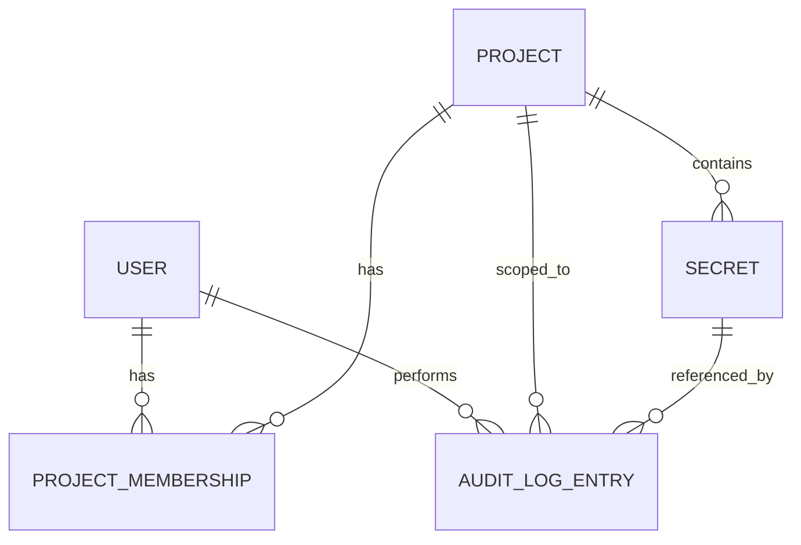

# Data Model

## Entity Relationship Overview

`Environment` is **not** a separate collection. It's an enum value stored
on `Secret`, with the allowed values for a project listed on `Project`.

## User

| Field                     | Type     | Constraints                                                                                                                                                                                                                                                                                                                                                                                                                                                                                                                                                                                                            |
| ------------------------- | -------- | ---------------------------------------------------------------------------------------------------------------------------------------------------------------------------------------------------------------------------------------------------------------------------------------------------------------------------------------------------------------------------------------------------------------------------------------------------------------------------------------------------------------------------------------------------------------------------------------------------------------------- |
| `_id`                     | ObjectId | primary key                                                                                                                                                                                                                                                                                                                                                                                                                                                                                                                                                                                                            |
| `email`                   | string   | required, unique, lowercase                                                                                                                                                                                                                                                                                                                                                                                                                                                                                                                                                                                            |
| `passwordHash`            | string   | required, bcrypt hash, `select: false` — the same reasoning as `Secret.ciphertext`/`iv`/`authTag`: `authenticate` re-fetches the full user document on every request, and `/admin/users` returns user lists, so without `select: false` the hash is one forgotten response-shaping step away from leaking. Login is the one query that explicitly opts back in with `.select('+passwordHash')` (see ARCHITECTURE.md's Authentication Flow). Never returned in API responses regardless — `publicUserSchema.parse()` strips it even if a query ever forgot to exclude it (see ARCHITECTURE.md's Repository Boundaries). |
| `tokenVersion`            | number   | default `0`. Embedded in the JWT at login, compared against the live value on every request by `authenticate`; a mismatch invalidates the token immediately regardless of its remaining 7-day lifetime. Bumped on bootstrap promotion (see Bootstrapping, PRODUCT.md story 11) so a squatter's already-issued cookie can't survive a password reset. See ARCHITECTURE.md's Authentication Flow for the full reasoning.                                                                                                                                                                                                 |
| `isPlatformAdmin`         | boolean  | default `false`. Global flag — not a project role.                                                                                                                                                                                                                                                                                                                                                                                                                                                                                                                                                                     |
| `isActive`                | boolean  | default `true`. `false` blocks login; historical audit entries remain attributed to this user.                                                                                                                                                                                                                                                                                                                                                                                                                                                                                                                         |
| `createdAt` / `updatedAt` | Date     | Mongoose timestamps                                                                                                                                                                                                                                                                                                                                                                                                                                                                                                                                                                                                    |

## PlatformConfig

A **singleton** collection — exactly one document ever exists. Exists
for one reason: `isPlatformAdmin` is a flag scattered across many `User`
documents, so there's no single document to attach an atomic admin-count
guard to the way `Project.activeAdminCount` works for the per-project
invariant. This document is that single place.

| Field                      | Type                                | Constraints                                                                                                                                                                                                                                                                                                                                                                                                                                                                                                                                                         |
| -------------------------- | ----------------------------------- | ------------------------------------------------------------------------------------------------------------------------------------------------------------------------------------------------------------------------------------------------------------------------------------------------------------------------------------------------------------------------------------------------------------------------------------------------------------------------------------------------------------------------------------------------------------------- |
| `_id`                      | fixed constant (e.g. `'singleton'`) | not an `ObjectId` — the fixed value is what makes "the one document" enforceable without a separate uniqueness mechanism                                                                                                                                                                                                                                                                                                                                                                                                                                            |
| `activePlatformAdminCount` | number                              | required. Maintained by every operation that grants/revokes `isPlatformAdmin` or flips `isActive` on a user who has it — incremented when a user becomes an active Platform Admin (bootstrap, or `PATCH /admin/users/:userId` granting the flag to an already-active user, or reactivating an already-admin user), decremented when one stops being one (demotion, deactivation, or both). See the Platform Admin invariant in API.md's Permissions Matrix notes for why. **Bootstrap creates and initializes this singleton with `activePlatformAdminCount = 1`.** |
| `updatedAt`                | Date                                | Mongoose timestamp                                                                                                                                                                                                                                                                                                                                                                                                                                                                                                                                                  |

## Project

| Field                     | Type                  | Constraints                                                                                                                                                                                                                                                                                                                                                                                                                                                                                                                                                      |
| ------------------------- | --------------------- | ---------------------------------------------------------------------------------------------------------------------------------------------------------------------------------------------------------------------------------------------------------------------------------------------------------------------------------------------------------------------------------------------------------------------------------------------------------------------------------------------------------------------------------------------------------------- |
| `_id`                     | ObjectId              | primary key                                                                                                                                                                                                                                                                                                                                                                                                                                                                                                                                                      |
| `name`                    | string                | required                                                                                                                                                                                                                                                                                                                                                                                                                                                                                                                                                         |
| `environments`            | string[]              | required. **MVP: always the three canonical names `['development', 'staging', 'production']`**, set at creation (`POST /projects` takes only `name`); no endpoint edits them. The rules for custom environments are design notes under _Post-MVP: custom environments_, below.                                                                                                                                                                                                                                                                                   |
| `activeAdminCount`        | number                | required, default `1` (set when the creating user becomes `projectAdmin`). Maintained by every operation that grants or revokes `projectAdmin` on this project — incremented when a membership becomes `projectAdmin` (creation or role change into it), decremented when it stops being `projectAdmin` (role change away from it, or removal). See the Project Admin invariant in API.md's Permissions Matrix notes for why this field exists: it's what makes that invariant checkable as a single atomic conditional update instead of a count-then-act race. |
| `status`                  | enum                  | `'active' \| 'archived'`, default `'active'`. Nothing sets `archived` in the MVP (archive/restore is post-MVP).                                                                                                                                                                                                                                                                                                                                                                                                                                                  |
| `createdBy`               | ObjectId (ref `User`) | required                                                                                                                                                                                                                                                                                                                                                                                                                                                                                                                                                         |
| `createdAt` / `updatedAt` | Date                  | Mongoose timestamps                                                                                                                                                                                                                                                                                                                                                                                                                                                                                                                                              |

### Post-MVP: custom environments (design notes, not built)

When environment editing ships (`PATCH /projects/:projectId`, see API.md): `development`/`staging`/`production` can never be removed or renamed; extra names (e.g. `qa`, `demo`) can be added or removed, and the Permissions Matrix treats them like `staging`. Every name must match `^[a-z0-9-]{1,32}$` (lowercase, case-insensitive-unique within a project). That closes the sharpest footgun — a lookalike `Production` that gets none of `production`'s protections — and keeps `|` out of names, which matters because environment names are concatenated into the AES-GCM AAD string with `|` as a delimiter (ARCHITECTURE.md). It does not close the whole family: a near-miss name like `prod-eu` or `live` still gets `staging`-level treatment (no confirm on reveal, Developer can't write), and nothing infers intent from a name. A per-environment `requiresConfirm` flag would fix that, but turns `environments` into a richer structure touching the schema, the `PATCH` body and the Permissions Matrix — out of scope; naming the limitation is the chosen mitigation. Removing an environment also introduces a write-skew race with secret creation (API.md, _Post-MVP: environment editing and the write-skew race_).

## ProjectMembership

Join collection between `User` and `Project`. A user's role is scoped to
one project via one document per (user, project) pair.

| Field                     | Type                     | Constraints                                                                                                                           |
| ------------------------- | ------------------------ | ------------------------------------------------------------------------------------------------------------------------------------- |
| `_id`                     | ObjectId                 | primary key                                                                                                                           |
| `userId`                  | ObjectId (ref `User`)    | required — a `ProjectMembership` document represents one real user's role on one real project; there's no membership without a member |
| `projectId`               | ObjectId (ref `Project`) | required                                                                                                                              |
| `role`                    | enum                     | `'projectAdmin' \| 'developer' \| 'auditor'`, required                                                                                |
| `createdAt` / `updatedAt` | Date                     | Mongoose timestamps                                                                                                                   |

**Constraint:** compound unique index on `(userId, projectId)` — a user
has exactly one role per project.

**MVP scope:** `ProjectMembership` is fully MVP-visible (created on project creation, listed on MembersPage, added via POST /members). Role change and removal endpoints exist on backend for last-Project-Admin invariant test but have no UI in MVP.

## Secret

| Field                              | Type                     | Constraints                                                                                                                                                                                                                                                                                                                                                                                                                                                                                             |
| ---------------------------------- | ------------------------ | ------------------------------------------------------------------------------------------------------------------------------------------------------------------------------------------------------------------------------------------------------------------------------------------------------------------------------------------------------------------------------------------------------------------------------------------------------------------------------------------------------- |
| `_id`                              | ObjectId                 | primary key                                                                                                                                                                                                                                                                                                                                                                                                                                                                                             |
| `projectId`                        | ObjectId (ref `Project`) | required                                                                                                                                                                                                                                                                                                                                                                                                                                                                                                |
| `environment`                      | string                   | required. Must be one of the parent `Project.environments` — MongoDB has no cross-document constraint for this, so it's enforced in the `secrets.service.ts` service layer before any write, not at the schema level.                                                                                                                                                                                                                                                                                   |
| `key`                              | string                   | required. 1–100 chars, `[A-Z0-9_]` (uppercase env-var convention), validated by the shared Zod schema                                                                                                                                                                                                                                                                                                                                                                                                   |
| `value` (input only, never stored) | string                   | max 4KB, the typical practical limit for an env var value                                                                                                                                                                                                                                                                                                                                                                                                                                               |
| `ciphertext`                       | Buffer                   | required. Never selected (`select: false`) on list/metadata queries — only fetched explicitly by the reveal service.                                                                                                                                                                                                                                                                                                                                                                                    |
| `iv`                               | Buffer                   | required, 12 bytes, also `select: false` — same reasoning and same reveal-service-only access as `ciphertext`, above. A **fresh random IV is generated on every encrypt operation, including secret edits** — never reused with the same key. No uniqueness constraint at the DB level; IVs can coincidentally collide across unrelated secrets without being a problem, since GCM's requirement is "never reuse an IV with the same key," not global uniqueness.                                       |
| `authTag`                          | Buffer                   | required, 16 bytes (AES-256-GCM authentication tag), also `select: false` — all three of `ciphertext`/`iv`/`authTag` are excluded from list/metadata queries together, matching API.md's promise that none of the three is ever selected on that endpoint for any role.                                                                                                                                                                                                                                 |
| `createdBy` / `lastEditedBy`       | ObjectId (ref `User`)    | required / optional                                                                                                                                                                                                                                                                                                                                                                                                                                                                                     |
| `lastAccessedAt`                   | Date                     | optional. Updated only after an allowed reveal                                                                                                                                                                                                                                                                                                                                                                                                                                                          |
| `lastAccessedBy`                   | ObjectId (ref `User`)    | optional. Actor from the last allowed reveal                                                                                                                                                                                                                                                                                                                                                                                                                                                            |
| `encryptionKeyVersion`             | number                   | required — see Encryption Key Lifecycle, below, for what this identifies and why there's only ever one valid value in this build. `MASTER_KEY_VERSION` arrives from the environment as a string (all env vars are); the server `parseInt()`s it once at boot, and boot validation checks it parses to a positive integer, not merely that the variable is non-empty — a typo'd, non-numeric `MASTER_KEY_VERSION` should fail loudly at startup, not produce `NaN` comparisons against this field later. |
| `createdAt` / `updatedAt`          | Date                     | Mongoose timestamps                                                                                                                                                                                                                                                                                                                                                                                                                                                                                     |

**Constraint:** compound unique index on `(projectId, environment, key)` —
no duplicate key within the same project + environment.

**Delete semantics:** deleting a `Secret` is a **hard delete** — the
document is removed. The audit log preserves the key name via the
`AuditLogEntry.secretKey` field (below), so the history stays readable
even after the secret itself is gone. This is different from `Project`
deletion, which is a status change (`archived`), not a delete.

**On ciphertext integrity:** `ciphertext`/`iv`/`authTag` alone would let
anyone with raw DB write access swap one secret's encrypted blob onto a
different document and have it decrypt without error — GCM's auth tag
only proves the ciphertext wasn't tampered with, not which record it
belongs to. This build binds each record's own identity in as Additional
Authenticated Data on encrypt/decrypt; see ARCHITECTURE.md's Secret
Encryption & Reveal Flow for the full explanation.

## AuditLogEntry

| Field                      | Type                                                | Constraints                                                                                                                                                                                                                                                                                                                                                                                                                                                                                                                                                                                                                                                                                                     |
| -------------------------- | --------------------------------------------------- | --------------------------------------------------------------------------------------------------------------------------------------------------------------------------------------------------------------------------------------------------------------------------------------------------------------------------------------------------------------------------------------------------------------------------------------------------------------------------------------------------------------------------------------------------------------------------------------------------------------------------------------------------------------------------------------------------------------- |
| `_id`                      | ObjectId                                            | primary key                                                                                                                                                                                                                                                                                                                                                                                                                                                                                                                                                                                                                                                                                                     |
| `userId`                   | ObjectId (ref `User`)                               | required                                                                                                                                                                                                                                                                                                                                                                                                                                                                                                                                                                                                                                                                                                        |
| `projectId`                | ObjectId (ref `Project`)                            | required for project-scoped actions — the four secret actions, the three membership actions, and the five `project_*` actions; absent for the platform-wide actions (`user_activated`/`user_deactivated`/`platform_admin_granted`/`platform_admin_revoked`/`bootstrap_admin`), which have no single project to attach to. Enforced in the audit-logging service, not a Mongoose schema validator — there's no public endpoint that creates an `AuditLogEntry` directly (it's always a side effect the service attaches to another action), so the service being correct is the guard, not request-input validation. This is exactly the kind of rule the Supertest priority list in TECH_STACK.md should cover. |
| `secretId`                 | ObjectId (ref `Secret`)                             | optional (absent for project/team-level actions)                                                                                                                                                                                                                                                                                                                                                                                                                                                                                                                                                                                                                                                                |
| `secretKey`                | string                                              | optional denormalized copy of the secret's key at the time of the action, so history stays readable after deletion                                                                                                                                                                                                                                                                                                                                                                                                                                                                                                                                                                                              |
| `targetUserId`             | ObjectId (ref `User`)                               | optional target for user administration and membership events                                                                                                                                                                                                                                                                                                                                                                                                                                                                                                                                                                                                                                                   |
| `previousRole` / `newRole` | enum (`'projectAdmin' \| 'developer' \| 'auditor'`) | both optional, set only on `member_role_changed` — the one before/after pair this build captures. See the note below the table for why this is deliberately narrow rather than general-purpose diffing.                                                                                                                                                                                                                                                                                                                                                                                                                                                                                                         |
| `environment`              | string                                              | optional. Present only for the four secret-level actions (`reveal`/`create`/`edit`/`delete`), so a reveal can be distinguished as prod vs dev at a glance; absent for every other action in the enum                                                                                                                                                                                                                                                                                                                                                                                                                                                                                                            |
| `action`                   | enum                                                | `'reveal' \| 'create' \| 'edit' \| 'delete' \| 'member_added' \| 'member_role_changed' \| 'member_removed' \| 'project_created' \| 'project_renamed' \| 'project_environments_changed' \| 'project_archived' \| 'project_restored' \| 'user_activated' \| 'user_deactivated' \| 'platform_admin_granted' \| 'platform_admin_revoked' \| 'bootstrap_admin'`                                                                                                                                                                                                                                                                                                                                                      |
|                            |                                                     | **Written and shown in the MVP project audit log:** `reveal`, `create`, `edit`, `delete`, `member_added`, `project_created`                                                                                                                                                                                                                                                                                                                                                                                                                                                                                                                                                                                     |
|                            |                                                     | **Written by backend-only endpoints (no MVP UI trigger; still shown in the project log if they occur):** `member_role_changed`, `member_removed`                                                                                                                                                                                                                                                                                                                                                                                                                                                                                                                                                                |
|                            |                                                     | **Written, no MVP reader (platform-wide, no `projectId`):** `user_activated`, `user_deactivated`, `platform_admin_granted`, `platform_admin_revoked`, `bootstrap_admin`                                                                                                                                                                                                                                                                                                                                                                                                                                                                                                                                         |
|                            |                                                     | **Post-MVP, no endpoint yet:** `project_renamed`, `project_environments_changed`, `project_archived`, `project_restored`                                                                                                                                                                                                                                                                                                                                                                                                                                                                                                                                                                                        |
| `result`                   | enum                                                | `'allowed' \| 'denied'`                                                                                                                                                                                                                                                                                                                                                                                                                                                                                                                                                                                                                                                                                         |
| `createdAt`                | Date                                                | see index, below                                                                                                                                                                                                                                                                                                                                                                                                                                                                                                                                                                                                                                                                                                |

17 `action` values in total: 12 are project-scoped (four secret actions, three membership actions, five `project_*` actions) and 5 are platform-wide (no `projectId`).

**On before/after detail, deliberately narrow:** `previousRole`/`newRole`
on `member_role_changed` is the one before/after pair this build records,
because a role change is the single highest-value one for a security
audit log to show at a glance (who _could_ do what, before vs after) and
it's two small enum fields, not a new pattern. Generalizing this — old/new
project names on `project_renamed`, before/after arrays on environment
edits, and so on — would mean every mutation handler needs its own
snapshot-then-diff logic, which is real added scope across many actions,
not one. This build accepts that broader before/after detail is a gap for
those other actions (the _that_ something changed is still logged, just
not the _from what_) rather than building a generic diffing mechanism for
a two-person build. `project_environments_changed` is post-MVP (environment editing deferred).

**Constraint:** `AuditLogEntry` documents are append-only — no update or
delete endpoint exists for this collection, by design.

**Indexes:** compound index on `(projectId, createdAt descending)` for
project audit reads, plus `(createdAt descending)` for platform-wide audit reads (post-MVP — no MVP reader, so create it when the admin audit view ships). Platform-wide events have no `projectId`, so they don't benefit
from the compound index — that's exactly why the plain
`(createdAt descending)` index exists alongside it, rather than trying to
make one index serve both read patterns.

**Platform-wide actions:** `user_activated`, `user_deactivated`, `platform_admin_granted`, `platform_admin_revoked`, `bootstrap_admin` are written but have no reader in MVP (admin audit log is post-MVP). `userId` is the acting admin and `targetUserId` the affected user.

**Integrity:** audit entries are append-only. State-changing actions and
their allowed audit entries commit in one MongoDB transaction. Denied
project actions write their denied entry before returning `403`; if that
write fails, the API returns `500 INTERNAL_ERROR` instead.
**Trade-off, accepted deliberately:** this makes every authorization
outcome — allowed _or_ denied — dependent on a successful DB write; a
legitimate `403` can surface to the client as a `500` if the audit write
fails. The alternative (return the `403` immediately, write the audit
entry best-effort afterward) would let an attacker's failed attempts go
unrecorded during exactly the kind of transient DB hiccup an attacker
might time around — worse for this project's threat model than an
occasional extra `500`.

**Retention:** none for this build — entries are kept indefinitely, with
no purge policy. This is a deliberate scope decision (a compliance-grade
retention/archival policy is a project of its own), not an oversight.

**Not captured:** IP address and user-agent are not stored in the MVP
audit document. Application security logs may capture request correlation
ID, source IP, and user-agent in a separate restricted sink. Failed login
attempts are handled the same way rather than as an `AuditLogEntry`: an
unrecognized email isn't a `User`, so there's no reliable `userId` to
attribute the entry to, and no project to scope it to either — it doesn't
fit this collection's shape. They're covered by rate limiting (API.md)
and the application security log just mentioned, not by the audit trail,
which is why `login_failed` isn't in the `action` enum above.

## Encryption Key Lifecycle (this build)

Each Secret stores `encryptionKeyVersion`, identifying which master key
encrypted it — but in this build there is exactly **one** active key,
configured via `MASTER_KEY` / `MASTER_KEY_VERSION` at boot. The field
exists so that adding real rotation later is an additive change, not a
schema migration; it is not evidence that rotation itself is implemented
now. On read, the server decrypts using the version stored on the
document; if that stored version doesn't match the currently configured
`MASTER_KEY_VERSION`, decryption fails loudly (there's only ever one
version to match against in this build) rather than silently trying to
resolve it against a table of keys that doesn't exist.

**Future work, not this build:** supporting multiple concurrently valid
keys, a background job that gradually re-encrypts existing secrets under
the new key, and a verified retirement step for the old key once nothing
references it anymore. That's a subsystem of its own — comparable in
scope to the migration tooling below — and is out of scope for a
two-person build for the same reason. See PRODUCT.md's Non-Goals.

## Migrations

No migration framework is used for this build. Development uses a
dedicated Atlas database that both contributors have agreed is disposable
— it is expected to be dropped and recreated whenever a schema change
would otherwise require a manual data-fix, rather than treating it as
data worth preserving across schema changes.

**Future work:** the moment there's data anyone actually wants to keep
across a schema change — which could be as early as a shared staging
environment, not only "before production" — adopt a migration tool (e.g.
`migrate-mongo`) so schema changes can be applied to existing documents
without a manual fix or a drop-and-recreate.
